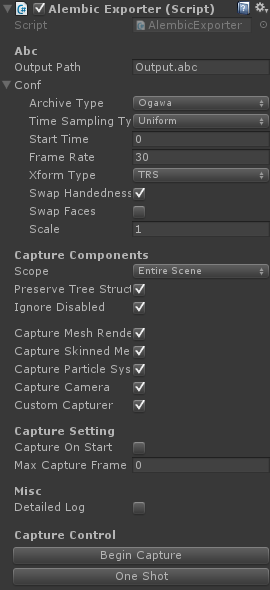

- [Alembic?](#alembic)
- [Alembic Importer](#alembic-importer)
- [Alembic Exporter](#alembic-exporter)

# Alembic?
Alembic は主に映画業界で使われているデータフォーマットで、巨大な頂点キャッシュデータを格納するのに用いられます。  スキニングやダイナミクスなどのシミュレーション結果を全フレームベイクして頂点キャッシュに変換し、それを alembic に格納してレンダラやコンポジットのソフトウェアに受け渡す、というような使い方がなされます。  
近年の DCC ツールの多くは Alembic をサポートしており、Alembic のインポートやエクスポートができれば、Unity をレンダリングやコンポジットのツールとして使ったり、Unity で各種シミュレーションを行ってその結果を他の DCC ツールに渡したりといったことができるようになります。  
(Alembic 本家: http://www.alembic.io/ )  

# Alembic Importer
  
パッケージ: [AlembicImporter.unitypackage](Packages/AlembicImporter.unitypackage?raw=true)

Alembic ファイルのジオメトリを Unity 上で再生するプラグインです。現在 Camera、PolyMesh、Points の再生に対応しています。  
Alembic ファイルに含まれるノード群を Unity 側で GameObject として再構築、PolyMesh を含むノードは MeshFilter や MeshRenderer も生成し、データをファイルからストリーミングして再生します。  
注意すべき点として、**Alembic ファイルは Assets/StreamingAssets 以下に置く必要があります**。これはストリーミングでデータ読み込む都合上、ビルド後も .abc ファイルがそのまま残っている必要があるためです。

上記パッケージをプロジェクトにインポート後、下記スクリーンショットのメニューより Alembic のインポートを行うことができます。  
  

# Alembic Exporter
パッケージ: [AlembicExporter.unitypackage](Packages/AlembicExporter.unitypackage?raw=true)

Unity のシーン内のジオメトリを Alembic に書き出すプラグインです。
MeshRenderer, SkinnedMeshRenderer, ParticleSystem (point cache として出力), Camera の書き出しに対応しており、カスタムハンドラを書けば独自のデータも出力できるようになっています。

エクスポートを行うには、上記パッケージをインポート後、AlembicExporter コンポーネントを適当なオブジェクトに追加します。   
  
以下は各項目の説明です。

- Path  
  出力パスを指定します。  

- Archive Type  
  Alembic のフォーマットの指定で、大抵は Ogawa のままで問題ないと思われます。  

- Time Sampling Type  
  キャプチャの間隔の指定です。
  これを Uniform にした場合、Alembic 側のフレーム間のインターバルは常に一定 (Time Per Sample 秒) になります。そして、これを選んでキャプチャを開始した場合した場合、**Time.maxDeltaTime が TimePerSample に固定された上、毎フレームこの間隔を待つようになります**。  
  Acyclic にした場合、Unity 側のデルタタイムがそのまま Alembic 側のフレーム間のインターバルになります。この場合当然間隔は一定ではなくなるため、映像制作には通常 Uniform を選ぶことになるでしょう。  
  Start Time と Time Per Sample は、Time Sampling Type が Uniform の場合に使われる数値です。

- Swap Handedness  
  有効にすると 右手座標系 / 左手座標系 を入れ変える処理を挟みます。
  DCC ツールの多くは Unity とは逆の座標系なので、大抵は有効にしておいたほうがいいでしょう。  

- Scope  
  Entire Scene の場合文字通りシーン内のキャプチャ可能な全オブジェクトをキャプチャします。
  Current Branch の場合その Alembic Exporter コンポーネントがついている GameObject 以下のツリーのみをキャプチャします。

- Preserve Tree Structure  
  有効にした場合、キャプチャ対象の親オブジェクト群の Transform も Alembic 側に含めます。無効の場合キャプチャ対象のみ含めます。
  無効の方が情報量は少なく、見た目は変わらないはずなのですが、現在無効だと回転がおかしくなるケースがあるようで、有効にしておいたほうが無難です。

- Capture (コンポーネント名)  
  各コンポーネントのキャプチャの有効/無効を指定します。

- Ignore Disabled  
  これが有効な場合、disabled されたオブジェクトはキャプチャ対象コンポーネントであっても除外されます。

- Begin / End Capture, One Shot  
  キャプチャを開始 / 停止します。OneShot は現在の 1 フレームだけをキャプチャします。  
  これらはスクリプトから BeginCapture() / EndCapture() / OneShot() を呼ぶことで同機能にアクセスできます。UI を独自作る場合でも組み込みは容易でしょう。

キャプチャ対象オブジェクトはキャプチャ開始時に決定され、途中で変わることはありません。なので、オブジェクトの enabled / disabled はキャプチャの途中で変わってもキャプチャには影響しません。  
キャプチャの途中で対象オブジェクトが削除された場合はそのオブジェクトのキャプチャは中断されてしまいますが、その結果できたサンプル数が不均一な Alembic ファイルはややイレギュラーな状態であり、正しく処理できないソフトウェアもあると予想されます。避けたほうがいいシチュエーションです。  
Export 結果の各ノードは名前に "(FFFE9E18)" のようなハッシュ値が付与されます。これは名前の衝突を避けるための処置です。(Alembic は同じ階層に名前が同じノードがあってはいけないルールになっています)

## 謝辞
- Alembic およびそれに付随するライブラリ群 (HDF5, ILMBase) を使用しています。  
  http://www.alembic.io/

## License
Copyright (C) 2015 Unity Technologies Japan, G.K.

Permission is hereby granted, free of charge, to any person obtaining a copy of this software and associated documentation files (the "Software"), to deal in the Software without restriction, including without limitation the rights to use, copy, modify, merge, publish, distribute, sublicense, and/or sell copies of the Software, and to permit persons to whom the Software is furnished to do so, subject to the following conditions: The above copyright notice and this permission notice shall be included in all copies or substantial portions of the Software.

THE SOFTWARE IS PROVIDED "AS IS", WITHOUT WARRANTY OF ANY KIND, EXPRESS OR IMPLIED, INCLUDING BUT NOT LIMITED TO THE WARRANTIES OF MERCHANTABILITY, FITNESS FOR A PARTICULAR PURPOSE AND NONINFRINGEMENT. IN NO EVENT SHALL THE AUTHORS OR COPYRIGHT HOLDERS BE LIABLE FOR ANY CLAIM, DAMAGES OR OTHER LIABILITY, WHETHER IN AN ACTION OF CONTRACT, TORT OR OTHERWISE, ARISING FROM, OUT OF OR IN CONNECTION WITH THE SOFTWARE OR THE USE OR OTHER DEALINGS IN THE SOFTWARE.
